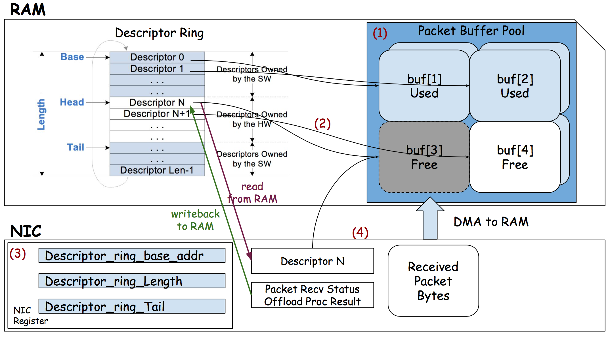
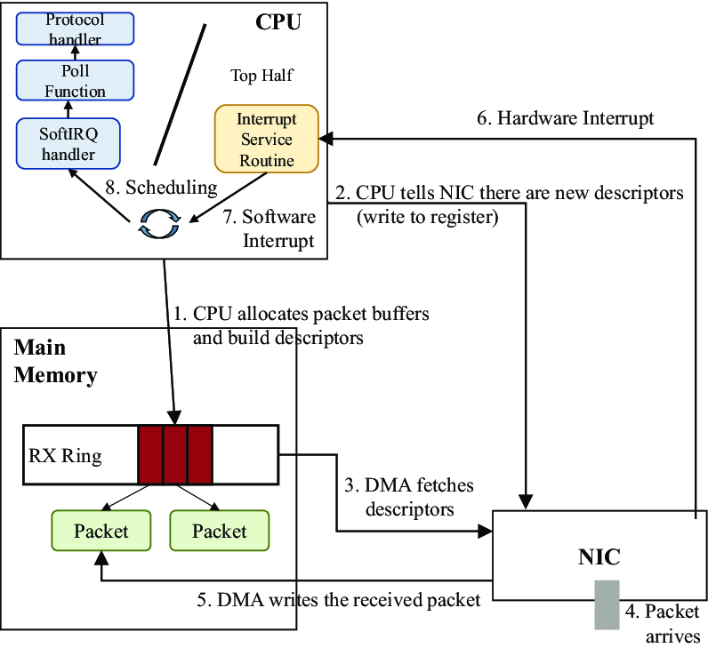

This picture explains the general the packet receive process. In memory, the descriptor ring contains receive descriptor packet.
Each descriptor points to a buffer used to store the incoming packet. In the ring structure, descriptor indexed by head waits for the next incoming packet.
The tail descriptor contains received packet to be consumed. Therefore, items between head and tail are free, or owned by hardware.
In NIC, information of ring in RAM is stored in the register.



A complete packet receive process: 
init
1. CPU allocates the descriptor ring and packet buffer.
2. CPU write NIC register: base_addr, length, head, tail.
NIC
3. DMA fetches one descriptor
4. packet arrives
5. DMA writes packet to buffer
OS
6. hardware interrupt to notice CPU packets available
7. kernel handle

TX path is pretty much the reverse: upper layer produces packet, 
driver copy packet data into packet buffer and let descriptor in tx ring points to it.
Driver set the CMD field of descriptor. 
NIC reads TX descriptor and DMA buffer from RAM to NIC.

In xv6, the TX/RX buffer is part of mbuf.
```c
struct mbuf {
  struct mbuf  *next; // the next mbuf in the chain
  char         *head; // the current start position of the buffer
  unsigned int len;   // the length of the buffer
  char         buf[MBUF_SIZE]; // the backing store
};

char *mbufpull(struct mbuf *m, unsigned int len);
char *mbufpush(struct mbuf *m, unsigned int len);
char *mbufput(struct mbuf *m, unsigned int len);
char *mbuftrim(struct mbuf *m, unsigned int len);

// The above functions manipulate the size and position of the buffer:
//            <- push            <- trim
//             -> pull            -> put
// [-headroom-][------buffer------][-tailroom-]
// |----------------MBUF_SIZE-----------------|
//

struct mbuf *mbufalloc(unsigned int headroom);
void mbuffree(struct mbuf *m);
```

The ring and mbuf pool
```c
static struct tx_desc tx_ring[TX_RING_SIZE] __attribute__((aligned(16)));
static struct mbuf *tx_mbufs[TX_RING_SIZE];

static struct rx_desc rx_ring[RX_RING_SIZE] __attribute__((aligned(16)));
static struct mbuf *rx_mbufs[RX_RING_SIZE];
```

TX
```c
// hold lock when processing one frame,
acquire(&e1000_lock);

uint64 tail = regs[E1000_TDT];
// if no free descriptor, fail to transmit
if(!(tx_ring[tail].status & E1000_TXD_STAT_DD)) {
release(&e1000_lock);
return -1;
}

// free used mbuf
if(tx_mbufs[tail] != 0) mbuffree(tx_mbufs[tail]);

// link buffer, set cmd, clear status
tx_mbufs[tail] = m;
tx_ring[tail].addr = (uint64)tx_mbufs[tail]->head;
tx_ring[tail].length = (uint16)tx_mbufs[tail]->len;
tx_ring[tail].cmd = E1000_TXD_CMD_RS | E1000_TXD_CMD_EOP;
tx_ring[tail].status = 0;

regs[E1000_TDT] = (tail + 1) % TX_RING_SIZE;
__sync_synchronize();
release(&e1000_lock);
return 0;
```

RX
```c
// consume all items owned by SW
for(;;){
  // lock processing one frame
  acquire(&e1000_lock);
  // @note tail in NIC register + 1 points to the next rx descriptor to consume
  uint64 tail = (regs[E1000_RDT] + 1) % RX_RING_SIZE;
  if (!(rx_ring[tail].status & E1000_RXD_STAT_DD)) {
    release(&e1000_lock);
    return;
  }
  struct mbuf* buf = rx_mbufs[tail];
  // consume buf then alloc a new one
  mbufput(buf, rx_ring[tail].length);
  rx_mbufs[tail] = mbufalloc(0);
  rx_ring[tail].addr = (uint64)rx_mbufs[tail]->head;
  rx_ring[tail].status = 0;
  regs[E1000_RDT] = tail;
  __sync_synchronize();
  release(&e1000_lock);
  
  // send buf to upper part
  net_rx(buf);
}
```

ref:

[descriptor concept in NIC](https://stackoverflow.com/questions/36625892/descriptor-concept-in-nic)

[xv6 solution net](https://github.com/KuangjuX/xv6-riscv-solution/tree/main/net)